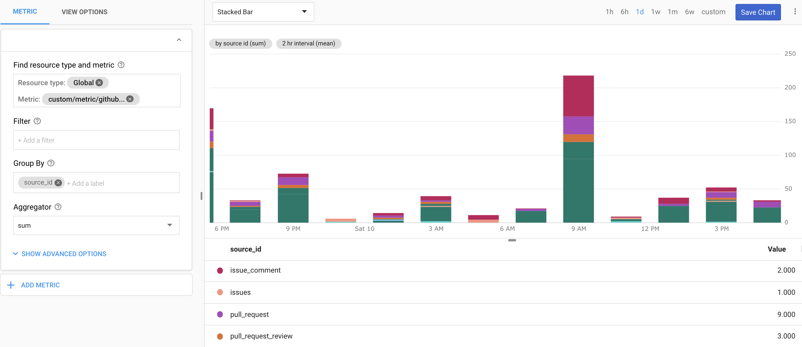
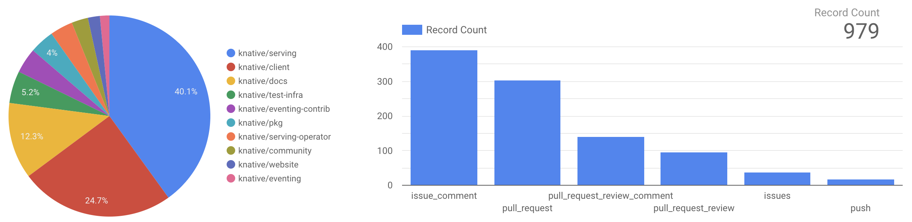
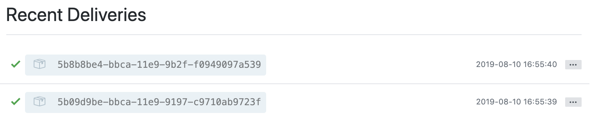
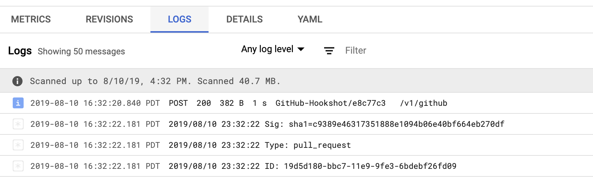
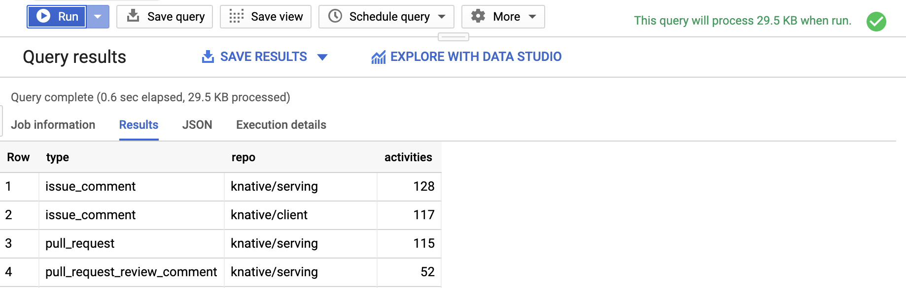

# github-activity-counter

Simple Cloud Run service you can configure as a target for GitHub event Webhook to monitor repository (or organization) activity in real-time.



Besides capturing the event throughput metrics in Stackdriver, this service also normalizes the GitHub activity data and stores the results in an easy to query BigQuery table which can be used in Google Sheets or Data Studio.



## Why

* Getting true GitHub activity is more nuanced than it would first appear (e.g. PR comments by author can be different from who committed that PR, i.e. CI pipeline)
* GitHub's own build-in tools and APIs don't expose data in an easy to query format (e.g. can't query for user associated with an org in specific time window)
* Most readily available SDKs/libraries address only the data retrieval (also have often many dependencies)

## Supported Event Types

The current implementation supports following event types:

* [issue_comment](https://developer.github.com/v3/activity/events/types/#issuecommentevent) - Issue comment created, edited, or deleted
* [commit_comment](https://developer.github.com/v3/activity/events/types/#commitcommentevent) - Commit comment is created
* [issues](https://developer.github.com/v3/activity/events/types/#issuesevent) - Issue opened, edited, deleted, transferred, closed, reopened, assigned, unassigned, labeled, unlabeled, milestoned, or demilestoned
* [pull_request](https://developer.github.com/v3/activity/events/types/#pullrequestevent) - Pull request assigned, unassigned, labeled, unlabeled, opened, edited, closed, reopened, or synchronized. (Note, also triggered when a pull request review is requested/removed)
* [pull_request_review_comment](https://developer.github.com/v3/activity/events/types/#pullrequestreviewcommentevent) - Comment on a pull request's unified diff is created, edited, or deleted
* [pull_request_review](https://developer.github.com/v3/activity/events/types/#pullrequestreviewcommentevent) - Comment on a pull request's unified diff is created, edited, or deleted
* [push](https://developer.github.com/v3/activity/events/types/#pushevent) - Push to a repository branch (also repository tag pushes)

> You can customize this service to support additional event types

## Extracted Data

| Element | Type   | Description                                                                                                                       |
| ------- | ------ | --------------------------------------------------------------------------------------------------------------------------------- |
| ID      | string | Immutable ID for specific WebHook delivery (important in case of duplicate WebHook submissions)                                   |
| Repo    | string | Fully-qualified name of the repository (e.g. `mchmarny/github-activity-counter`)                                                  |
| Type    | string | The type of GitHUb event (see [Events](#events)) for complete list                                                                |
| Actor   | string | GitHub username of the user who initialized that event (e.g. PR author vs the PR merger who could be a automation tool like prow) |
| EventAt | time   | Original event time (not the WebHook processing time, except for push which could include multiple commits)                       |

## Pre-requirements

### GCP Project and gcloud SDK

If you don't have one already, start by creating new project and configuring [Google Cloud SDK](https://cloud.google.com/sdk/docs/). Similarly, if you have not done so already, you will have [set up Cloud Run](https://cloud.google.com/run/docs/setup).

## Setup

To setup this service you will:

* Build docker image from the source in this repo (using Cloud Build)
* Configure service dependencies (PubSub topic, Dataflow job, BigQuery table)
* Deploy and configure service using the previously built image (Cloud Run)
* Setup WebHook (GitHub)

To start, clone this repo:

```shell
git clone https://github.com/mchmarny/github-activity-counter.git
```

And navigate into that directory:

```shell
cd github-activity-counter
```

### Configure Dependencies

To work properly, the Cloud Run service will require a few dependencies:

* PubSub topic to which it will publish events [name: `eventcounter`]
* BigQuery table to store the processed events [name: `eventcounter.events`]
* Dataflow job to stream events from PubSub to BigQuery [name: `eventcounter`]

To create these dependencies run the [bin/setup](./bin/setup) script:

```shell
bin/setup
```

In addition to the above dependencies, the `bin/setup` script also create a specific service account which will be used to run Cloud Run service. To ensure that this service is able to do only the intended tasks and nothing more, we are going to configure it with a few explicit roles:

* `run.invoker` - required to execute Cloud Run service
* `pubsub.publisher` - required to publish events to Cloud PubSub
* `logging.logWriter` - required for Stackdriver logging
* `cloudtrace.agent` - required for Stackdriver tracing
* `monitoring.metricWriter` - required to write custom metrics to Stackdriver

Finally, the ensure that our service is only accepting data from GitHub, we are going to created a secret that will be shared between GitHub and our service:

```shell
export HOOK_SECRET=$(openssl rand -base64 32)
```

> The above `openssl` command creates an opaque string. If for some reason you do not have `openssl` configured you can just set `HOOK_SECRET` to a your own secret. Just don't re-use other secrets or make it too easy to guess.

### Build Container Image

Cloud Run runs container images. To build one for this service we are going to use the included [Dockerfile](./Dockerfile) and submit it along with the source code as a build job to Cloud Build using [bin/image](./bin/image) script.

> You should review each one of the provided scripts for content to understand the individual commands

```shell
bin/image
```

### Deploy the Cloud Run Service

Once you have configured all the service dependencies, we can now deploy your Cloud Run service. To do that run [bin/service](./bin/service) script:

```shell
bin/service
```

The output of the script will include the URL by which you can access that service.

### Setup GitHub WebHook

GitHub has good [instructions](https://developer.github.com/webhooks/creating/) on how to setup your WebHook. In short it amounts to:

* Signing to GitHub, and navigating to repo or org settings
* Clicking `Webhooks` on the left panel
* Click on the `Add WebHook` button
* Pasting your deployed function URL (run `bin/url` if you can't remember it, make sure you include `/v1/github` in the POST target)
* Click `Edit` under Secret and paste your secret (run `echo $HOOK_SECRET`)
* Selecting `application/json` as the content type
* Select `Send me everything` or select individual events you want to count (see supported events)
* Leave the `Active` checkbox checked
* Click on `Add Webhook` to save your settings

## Test

To test the setup you can create an issue in the repo where you configured the WebHook. In the WebHook log there should be an indication the WebHook worked (response 200) or didn't.



Similarly on the Cloud Run side, you should be able to see the logs generated by `eventcounter` service using the function logs link and eventually there should be now data in the BigQuery table.



## Query

There is an endless ways you could analyze this data (e.g. Types of activities per repo or Average activity frequency per user). Here for example is a SQL query for type of activities per user over last 28 days:

```sql
SELECT actor, type, count(1) as activities
FROM eventcounter.events
WHERE event_time >= TIMESTAMP_SUB(CURRENT_TIMESTAMP(), INTERVAL 28 DAY)
GROUP BY actor, type
ORDER BY 3 desc
```



You can find a few more query samples in the [queries](./queries) directory.

## Cleanup

To cleanup all resources created by this sample execute the [bin/cleanup](bin/cleanup) script.

```shell
bin/cleanup
```

## Disclaimer

This is my personal project and it does not represent my employer. I take no responsibility for issues caused by this code. I do my best to ensure that everything works, but if something goes wrong, my apologies is all you will get.
