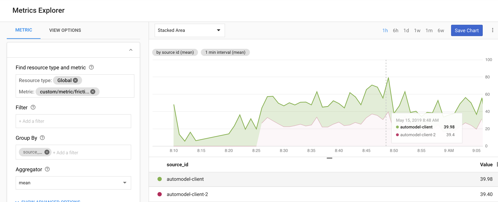

# gcputil/metric

In addition to all the built in metrics, the GPC Stackdriver also supports custom metrics which enable developers to create time series based on application metrics defined by users.

This utility simplifies the entire process related to creating creating and configuring custom metrics to two simple operations.

## Import

```shell
import "github.com/mchmarny/gcputil/metric"
```

## Usage

To create a metric client and then submit 1 metrics

```shell
ctx := context.Background()
c, err := metric.NewClient(ctx)
err = c.Publish(ctx, "thermometer-1", "temperature", float64(36.1))
```

## View

